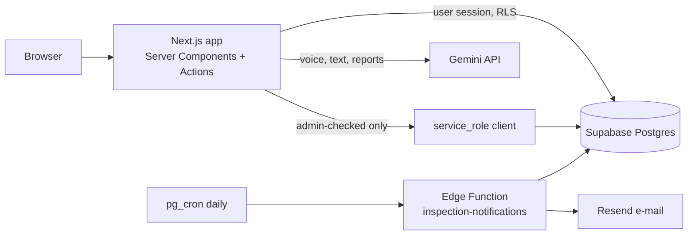

# Fleet Maintenance Platform

A multi-tenant web application for truck fleet and repair-shop operations. It manages vehicles, customers and technicians, tracks work orders from diagnosis to closeout, controls parts inventory, produces invoices as PDFs, schedules preventive maintenance and inspections, and reports on revenue and productivity. Each shop is an isolated tenant with role-based access and per-tenant feature flags, and Google Gemini assists with voice notes, text polishing and report summaries. The interface is in French.

## Who it's for

Independent truck repair shops and in-house fleet maintenance teams. Each role sees what it needs: technicians work on their assigned work orders, parts clerks manage stock, supervisors manage operations, and directors and admins handle invoicing, reports and the team. A platform administrator can host several shops on the same deployment, each fully isolated.

## Features

**Operations**
- **Work orders**: create and track with status, diagnosis, work performed, notes timeline and parts used (stock is deducted automatically by a database trigger); closeout form.
- **Voice notes**: dictate on a work order, transcribed and cleaned up by Gemini.
- **Vehicles, customers, technicians**: full CRUD with detail pages and service history.
- **Parts inventory**: catalog, low-stock view, barcode scanning (ZXing) and photo capture.

**Maintenance**
- Reusable maintenance templates applied to vehicles, with computed due status.
- Inspection categories, an inspection calendar, and a daily notification job (Supabase Edge Function + `pg_cron` + Resend e-mail).

**Back office**
- **Invoicing**: invoices with status transitions, multi-currency support and PDF export (`@react-pdf/renderer`).
- **Reports**: revenue, productivity and cost history, with an AI-generated summary.
- **Activity log**, **data explorer** and **document storage**.
- **Team management**: invite users and assign roles (`admin`, `directeur_service`, `superviseur`, `commis_pieces`, `technicien`).

**Platform**
- **Multi-tenancy** enforced with Postgres row-level security.
- **Feature flags** per tenant (work orders, parts, invoicing, maintenance, reporting, voice notes, user management).
- **Platform-admin area** to create tenants and toggle their features.

## Tech stack

| Layer | Technologies |
|-------|--------------|
| Frontend | Next.js 16 (App Router, Server Actions), React 19, TypeScript, Tailwind CSS 4 |
| Backend | Supabase: Postgres with RLS, Auth, Storage, Edge Functions, `pg_cron` / `pg_net`, Vault |
| AI | Google Gemini (speech transcription, text cleanup, report summaries) |
| Other | `@react-pdf/renderer`, ZXing barcode scanner, Resend (e-mail), Vercel (hosting) |

## Architecture



## Getting started

**Prerequisites:** Node.js 20+, a [Supabase](https://supabase.com) project, and (optional) a Gemini API key.

```bash
git clone https://github.com/WalidGabtni/fleet-maintenance-platform.git
cd fleet-maintenance-platform

# 1. Database
cd supabase
supabase link --project-ref YOUR-PROJECT-REF
supabase db push                       # applies supabase/migrations/*.sql
cd ..

# 2. Web app
cd web
cp .env.example .env.local             # fill in your Supabase and Gemini keys
npm install
npm run dev                            # http://localhost:3000
```

**First admin:** sign up or invite a user in Supabase Auth, then run in the SQL editor:

```sql
update profiles set role = 'admin', is_platform_admin = true where email = 'you@example.com';
```

**Notifications (optional):** deploy the edge function with `supabase functions deploy inspection-notifications`, set the `RESEND_API_KEY` secret, and store the service-role key in Vault as `edge_function_service_role_key`. In `supabase/migrations/20260802030000_inspection_notifications_cron.sql`, replace `YOUR-PROJECT-REF` with your project reference.

> The migrations are a cleaned-up copy of the real history: seed data and project identifiers were replaced with placeholders.

## Repository structure

```
.
├── web/                  Next.js app
│   ├── app/              routes: work-orders, vehicles, parts, invoices, maintenance, reports, team, platform-admin, ...
│   └── lib/              Supabase clients, permissions, feature flags, Gemini, types
├── supabase/
│   ├── migrations/       schema, RLS policies, triggers, seed
│   ├── functions/        inspection-notifications edge function
│   └── config.toml
└── docs/                 schema notes and screenshots
```

## Screenshots

<!-- Add screenshots to docs/images/ and link them here, e.g.  -->

| | |
|---|---|
| *Dashboard* → `docs/images/dashboard.png` | *Work order* → `docs/images/work-order.png` |
| *Inspection calendar* → `docs/images/calendar.png` | *Reports* → `docs/images/reports.png` |

## Author

**Walid Gabtni**: [@WalidGabtni](https://github.com/WalidGabtni)
